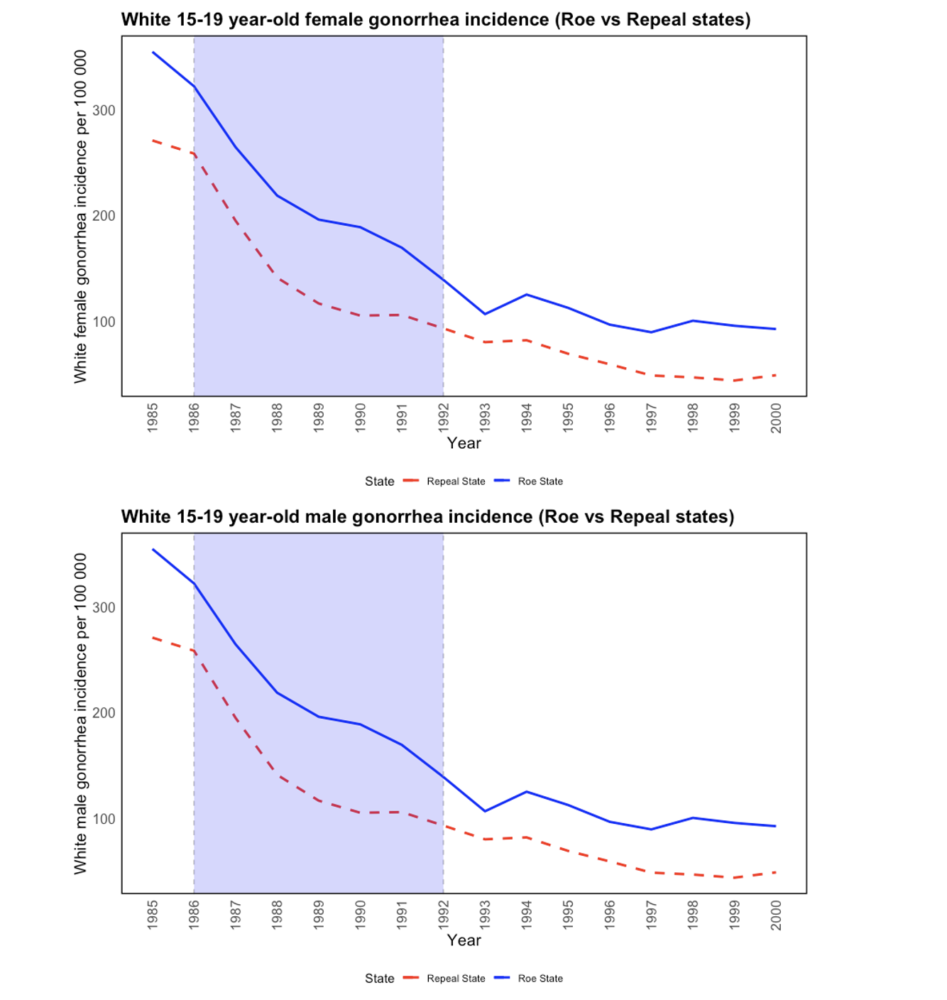
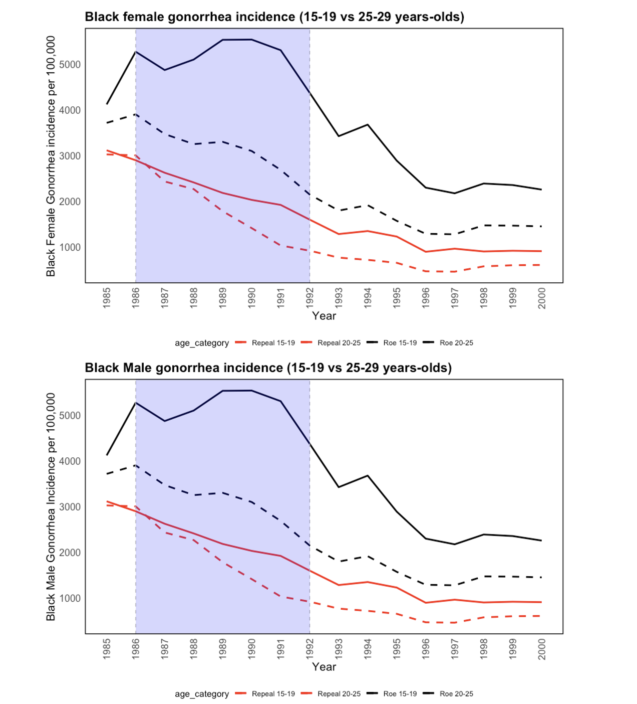
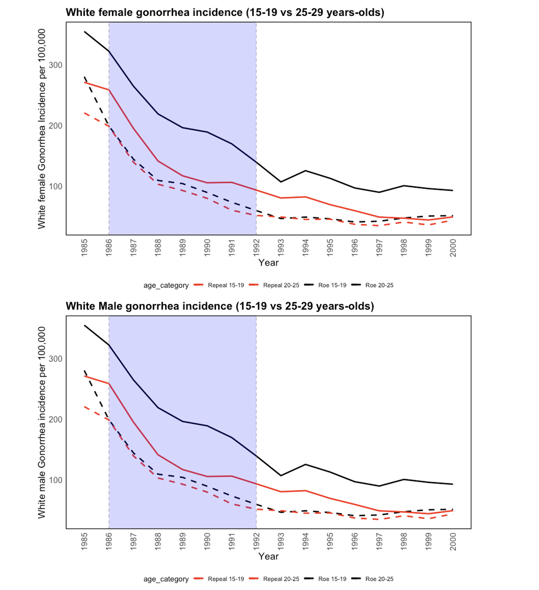

# Replication Paper: The Long-run Effect of Abortion on Sexually Transmitted Infections

**Author:** Prabin Adhikari  
**Date:** 2024-09-30

## Introduction
Cunningham and Cornwell (2013) study the long-run effect of abortion legalization on sexually transmitted infections (STIs), focusing on gonorrhea. The paper extends work on unintended and long-term social outcomes of abortion policy. Drawing on variation in the timing of legalization before the 1973 *Roe v. Wade* decision, the authors compare “early-repeal” states with “Roe” states using a difference-in-differences (DD) approach and a triple-difference (DDD) check with an older, untreated cohort.

The main cohort is ages 15–19, measured 15–19 years after legalization. The hypothesis is that legal access to abortion reduces unwanted births, shifts family dynamics and parental investment, and changes sexual health behavior. If the marginal child born without legalization is more likely to face single parenting and poverty, then legalization could lower later STI incidence.

Results show that gonorrhea incidence fell among Black adolescents in early-repeal states, especially for Black females, with the largest differences in mid-adolescence. Findings are weaker for Whites. The DDD design supports the DD pattern.

---

## Descriptive statistics

**Table 1. Covariate summary statistics**

| Group | Variable | N | Mean | SD | Min | Max |
|---|---|---:|---:|---:|---:|---:|
| Black Female | AIDS mortality | 737 | 33.01 | 49.26 | 0.00 | 454.30 |
| Black Female | Alcohol consumption per capita | 737 | 2.38 | 0.60 | 1.20 | 5.05 |
| Black Female | Crack index | 737 | 1.71 | 1.29 | -1.17 | 7.31 |
| Black Female | Male incarceration rate /10,000 | 737 | 434.02 | 319.96 | 0.00 | 3798.45 |
| Black Female | Poverty rate (%) | 737 | 13.10 | 4.21 | 2.90 | 27.20 |
| Black Female | Real income per capita (USD) | 737 | 20924.12 | 5387.49 | 9892.00 | 41489.00 |
| Black Female | State unemployment rate (%) | 737 | 5.58 | 1.80 | 2.26 | 13.44 |
| Black Male | AIDS mortality | 755 | 32.26 | 48.88 | 0.00 | 454.30 |
| Black Male | Alcohol consumption per capita | 755 | 2.37 | 0.58 | 1.20 | 5.05 |
| Black Male | Crack index | 755 | 1.67 | 1.31 | -1.17 | 7.31 |
| Black Male | Male incarceration rate /10,000 | 755 | 436.33 | 347.93 | 0.00 | 3798.45 |
| Black Male | Poverty rate (%) | 755 | 13.12 | 4.16 | 2.90 | 27.20 |
| Black Male | Real income per capita (USD) | 755 | 20848.50 | 5391.29 | 9892.00 | 41489.00 |
| Black Male | State unemployment rate (%) | 755 | 5.56 | 1.79 | 2.26 | 13.44 |
| White Female | AIDS mortality | 809 | 27.34 | 35.20 | 0.00 | 454.30 |
| White Female | Alcohol consumption per capita | 809 | 2.38 | 0.58 | 1.20 | 5.05 |
| White Female | Crack index | 809 | 1.60 | 1.31 | -1.17 | 7.31 |
| White Female | Male incarceration rate /10,000 | 809 | 96.07 | 35.56 | 0.00 | 262.78 |
| White Female | Poverty rate (%) | 809 | 12.99 | 4.03 | 2.90 | 27.20 |
| White Female | Real income per capita (USD) | 809 | 20533.55 | 5279.61 | 9892.00 | 41489.00 |
| White Female | State unemployment rate (%) | 809 | 5.52 | 1.77 | 2.26 | 13.44 |
| White Male | AIDS mortality | 803 | 28.31 | 38.24 | 0.00 | 405.76 |
| White Male | Alcohol consumption per capita | 803 | 2.38 | 0.59 | 1.20 | 5.05 |
| White Male | Crack index | 803 | 1.61 | 1.31 | -1.17 | 7.31 |
| White Male | Male incarceration rate /10,000 | 803 | 96.14 | 35.46 | 0.00 | 262.78 |
| White Male | Poverty rate (%) | 803 | 13.03 | 4.06 | 2.90 | 27.20 |
| White Male | Real income per capita (USD) | 803 | 20533.17 | 5302.39 | 9892.00 | 41489.00 |
| White Male | State unemployment rate (%) | 803 | 5.54 | 1.77 | 2.26 | 13.44 |

**Notes.** AIDS mortality and the crack index are higher on average for Black groups. Incarceration rates differ sharply by race. Poverty and unemployment rates are similar on average with wide ranges. Income per capita is comparable across groups with large within-group variation.

---

## Figures

### Figure 2. Gonorrhea incidence among 15–19-year-old Blacks in Roe and early-repeal states by gender, 1985–2000
  
The shaded region marks 1986–1992 when the in-utero treatment group enters. Incidence falls in early-repeal states relative to Roe states, with peak differences mid-period.

### Figure 3. Gonorrhea incidence among 15–19-year-old Whites in Roe and early-repeal states by gender, 1985–2000
  
Patterns are similar for White males and females but magnitudes are much lower than for Blacks. Divergence is smaller and less sustained.

### Figure 4. Gonorrhea incidence among 15–19 and 25–29-year-old Blacks in Roe and early-repeal states by gender, 1985–2000
  
Adding the older cohort enables DDD. The younger cohort shows stronger repeal–Roe divergence, consistent with in-utero exposure effects.

### Figure 5. Gonorrhea incidence among 15–19 and 25–29-year-old Whites in Roe and early-repeal states by gender, 1985–2000
  
Trends for Whites are more consistent across age groups, with weaker repeal–Roe differences.

---

## Difference-in-Differences model

**Specification**

\[
\ln GON_{st} = \beta_1 \text{Repeal}_s + \beta_2 D_t + \beta_{3t}(\text{Repeal}_s \times D_t) + X_{st}\gamma + \delta_s + \theta_1 t + \theta_2 (\delta_s \times t) + \varepsilon_{st}
\]

- \(GON_{st}\): new gonorrhea cases per 100,000 in state \(s\), year \(t\), ages 15–19  
- \(\text{Repeal}_s\): 1 if a state legalized abortion before *Roe*, 0 otherwise  
- \(D_t\): year indicators  
- \(X_{st}\): AIDS mortality, incarceration, parental involvement laws, alcohol, crack index, poverty, income, unemployment  
- \(\delta_s\): state fixed effects; \(\theta\): time trends  
- Main parameters: \(\beta_{3t}\) for 1986–1992

**Interpretation**  
Negative and significant \(\beta_{3t}\) for 1986–1992 match the hypothesis. Magnitudes peak mid-period and then decline.

### Table 2. Diff-in-Diff Baseline: Panel Fixed Effects Regressions of Early Repeal of Abortion on In Utero Cohort Log of 15–19-Year-Old Gonorrhea Incidence Rates by Race/Gender, 1985–2000

| Year | Black Female | Black Male | White Female | White Male |
|------|--------------|------------|--------------|------------|
| 1986 | -0.259** (0.081) | -0.162 (0.103) | -0.302* (0.163) | -0.189 (0.219) |
| 1987 | -0.342 (0.232)   | -0.194 (0.301) | -0.570* (0.310) | -0.389 (0.402) |
| 1988 | -0.611* (0.291)  | -0.411 (0.395) | -0.687* (0.344) | -0.469 (0.460) |
| 1989 | -0.785* (0.324)  | -0.555 (0.462) | -0.688** (0.244)| -0.468 (0.372) |
| 1990 | -0.632** (0.211) | -0.397* (0.203)| -0.447 (0.382)  | -0.262 (0.159) |
| 1991 | -0.553** (0.180) | -0.353* (0.202)| -0.361 (0.298)  | -0.258 (0.172) |
| 1992 | -0.442* (0.194)  | -0.235 (0.250) | -0.344 (0.366)  | -0.220 (0.206) |
| 1993 | -0.306 (0.270)   | -0.178 (0.182) | -0.238 (0.380)  | -0.220 (0.191) |
| 1994 | -0.118 (0.343)   | -0.033 (0.162) | -0.038 (0.585)  | -0.044 (0.175) |
| 1995 |  0.021 (0.366)   |  0.119 (0.189) |  0.177 (0.667)  |  0.207 (0.209) |
| 1996 | -0.124 (0.391)   | -0.056 (0.134) |  0.098 (0.791)  |  0.091 (0.204) |
| 1997 |  0.021 (0.494)   |  0.051 (0.112) |  0.295 (0.812)  |  0.252* (0.137) |
| 1998 | -0.036 (0.625)   | -0.071 (0.113) |  0.176 (0.953)  |  0.041 (0.179) |
| 1999 |  0.015 (0.635)   | -0.046 (0.052) |  0.178 (0.943)  |  0.019 (0.095) |
| 2000 |  0.041 (0.659)   |  0.127 (0.916) |  0.706 (1.354)  |  0.547 (0.905) |

*Note: Robust SEs in parentheses. * p < 0.10, ** p < 0.01, *** p < 0.001.*

**Summary**  
Black females: negative and significant 1986–1992, with peak magnitude around 1989 (about 23–55 percent reductions). With state trends, effects remain negative and smaller (about 15–43 percent). Black males show similar but weaker patterns. Estimates for Whites are smaller and mostly not significant.

---

## Triple-difference model

**Specification**

\[
\begin{aligned}
\ln GON_{ast} &= \beta_1 \text{Repeal}_s + \beta_2 D_t + \beta_{3t}(\text{Repeal}_s \times D_t)
+ \lambda_1 D_A + \lambda_2 (\text{Repeal}_s \times D_A) \\
&\quad + \lambda_{3t}(D_A \times D_t) + \lambda_{4t}(\text{Repeal}_s \times D_A \times D_t)
+ X_{st}\gamma + \delta_s + \delta_s D_A \\
&\quad + \theta_1 t + \theta_{2s} (\delta_s \times t) + \theta_3 (D_A \times t)
+ \theta_{4s} (\delta_s \times D_A \times t) + \varepsilon_{ast}
\end{aligned}
\]

- \(a\): age cohort (15–19 vs 25–29)  
- \(D_A\): cohort indicator (1 for 15–19, 0 for 25–29)  
- Main parameters: \(\lambda_{4t}\)

### Table 3. DDD (panel FE; state and age trends; state-clustered SEs)
### Table 3. Diff-in-Diff-in-Diff: Panel Fixed Effects Regressions of Early Repeal of Abortion on In Utero Cohort Log of 15–19-Year-Old Gonorrhea Incidence Rates by Race/Gender, 25–29 Comparison, 1985–2000

| Year | Black Female | Black Male | White Female | White Male |
|------|--------------|------------|--------------|------------|
| 1986 | -0.337** (0.117) | -0.389** (0.134) | -0.244* (0.131) | -0.274 (0.169) |
| 1987 | -0.389* (0.205)  | -0.451* (0.260)  | -0.215* (0.112) | -0.259 (0.181) |
| 1988 | -0.382* (0.170)  | -0.472* (0.241)  | -0.232* (0.103) | -0.308* (0.185) |
| 1989 | -0.277* (0.161)  | -0.380 (0.256)   |  0.048 (0.259)  | -0.043 (0.145) |
| 1990 | -0.046 (0.145)   | -0.163 (0.201)   |  0.202 (0.320)  |  0.090 (0.154) |
| 1991 |  0.079 (0.166)   | -0.039 (0.280)   |  0.308 (0.280)  |  0.196* (0.116) |
| 1992 |  0.122 (0.141)   |  0.005 (0.165)   |  0.183 (0.394)  |  0.071 (0.175) |
| 1993 | -0.168 (0.358)   | -0.261 (0.322)   | -0.123 (0.479)  | -0.213 (0.305) |
| 1994 |  0.239* (0.130)  |  0.112 (0.113)   |  0.231 (0.568)  |  0.112 (0.293) |
| 1995 |  0.151 (0.144)   |  0.060 (0.110)   |  0.295 (0.621)  |  0.207 (0.320) |
| 1996 |  0.183 (0.113)   |  0.095 (0.152)   |  0.311 (0.564)  |  0.222 (0.245) |
| 1997 |  0.357** (0.112) |  0.269* (0.128)  |  0.435 (0.515)  |  0.346* (0.181) |
| 1998 |  0.096 (0.104)   |  0.009 (0.092)   |  0.151 (0.441)  |  0.063 (0.093) |
| 1999 |  0.097 (0.120)   |  0.011 (0.125)   |  0.089 (0.288)  |  0.002 (0.091) |
| 2000 |  0.084 (0.148)   |  0.086 (0.390)   |  0.231 (0.522)  | -0.181 (0.903) |

*Note: Robust SEs in parentheses. * p < 0.10, ** p < 0.01, *** p < 0.001.*

**Summary**  
Black females show negative, significant triple differences through the mid-treatment period (about 32–38 percent reductions, 1986–1989), consistent with DD. Black males show similar reductions through 1988. Evidence for Whites is weaker; White females show negative and significant coefficients through 1988.

---

## Conclusion
Early abortion legalization is associated with lower gonorrhea incidence among Black teenagers, with the largest effects for Black females and the strongest differences in the mid-treatment years. Effects for Whites are smaller. A DDD comparison with 25–29-year-olds supports the DD findings. The study broadens the abortion-legalization hypothesis to STI outcomes and points to long-run public health benefits, especially for marginalized Black communities.

---

## References
- Cunningham, S., & Cornwell, C. (2013). Evidence on the long-run effects of abortion access on crime and health.  
- Donohue, J., & Levitt, S. (2001). The impact of legalized abortion on crime.

> Add full citations with journal names, volume, pages, and DOIs. Link the original paper if available.
